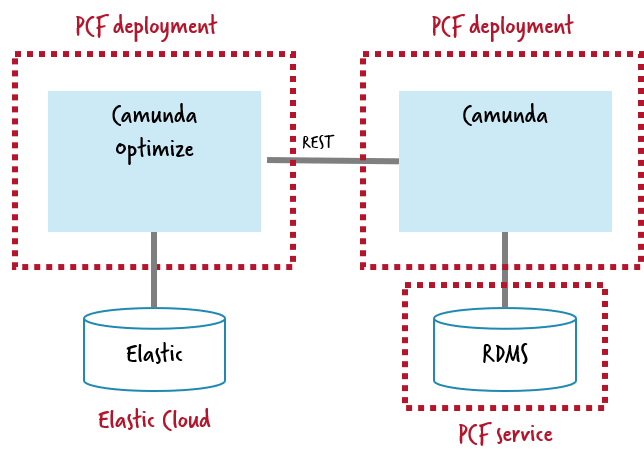

# Running Camunda Optimize on PCF

[Camunda Optimize](https://camunda.com/products/optimize/) is a business analysis tool that can make sense of data in Camunda engines. Please not that this is not available within the community edition and needs an [enterprise subscription](https://camunda.com/enterprise/). Nevertheless I wanted to include it here, as customers ask about running it on PCF.



Optimize is - like the Camunda engine - a Java application, so you can also run it using the Java build pack of PCF. It requires a REST connection to Camunda and an Elastic datasource to store data.

In order to properly configure Optimize this repo provides a small overlay project you can build and push, either locally, or again using your CI/CD pipeline as shown in the [Camunda as a Service / NodeJS sample](../../../nodejs-sample/).

# Screencast

<a href="http://www.youtube.com/watch?feature=player_embedded&v=w_EOtS9-pWU" target="_blank"></a>

# Step-by-step

1. Build this project locally. Make sure you have your [Camunda Enterprise Edition login configured](https://docs.camunda.org/get-started/apache-maven/#enterprise-edition-1). You can [get a trial license](https://camunda.com/download/enterprise/) here.

```
mvn clean install
```

2. Edit the config for your Camunda and Elastic installation in the [manifest.yml](manifest.yml), e.g.: 

```
      CAMUNDA_REST_ENDPOINT: http://camunda-on-pcf-engine-as-a-service.cfapps.io/rest
      CAMUNDA_REST_AUTH_ENABLED: false
      CAMUNDA_REST_USERNAME:
      CAMUNDA_REST_PASSWORD:
      CAMUNDA_WEBAPP_ENDPOINT: http://camunda-on-pcf-engine-as-a-service.cfapps.io/
      ELASTIC_CLUSTERNAME: elasticsearch
      ELASTIC_HOST: d104d2bf325044f183612f8c0c74bebd.europe-west1.gcp.cloud.es.io
      ELASTIC_PORT: 9243
      ELASTIC_SSL_ENABLED: true
      ELASTIC_USERNAME: elastic
      ELASTIC_PASSWORD: Aps0k8j9vnvipKdVxYUIhjR1
```

3. Push optimize to PCF:

```
cf push -f target/camunda-on-pcf-optimize-as-a-service.jar
```

4. Now you can access Optimize via the Route PCF creates, e.g. [http://camunda-on-pcf-optimize.cfapps.io/](http://camunda-on-pcf-optimize.cfapps.io/). Login with the credentials from the Camunda installation, which in the default case is *demo* / *demo*.
