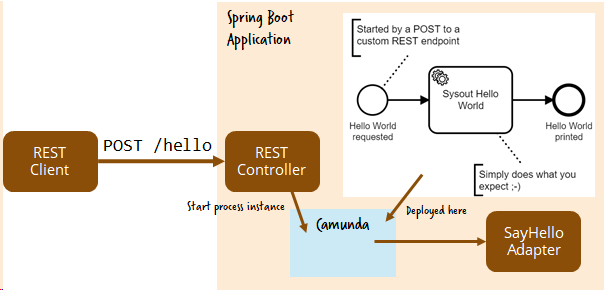

# Embed Camunda into your Spring Boot application

You can use Camunda as a library within your own Spring Boot application by leveraging the [Camunda Spring Boot Starter](https://docs.camunda.org/manual/latest/user-guide/spring-boot-integration/).

This is one of multiple [possible approaches](../../../).



# Step-by-step how-to

1. Add a [normal Spring REST controller](https://github.com/berndruecker/camunda-on-pcf/blob/master/spring-boot-embedded-engine-sample/src/main/java/com/camunda/demo/springboot/SysoutRestController.java#L15) to provide your custom REST API to say hello.

2. Add a Maven dependency (see [pom.xml](https://github.com/berndruecker/camunda-on-pcf/blob/master/spring-boot-embedded-engine-sample/pom.xml#L39)) for Camunda. There is one for the core engine, one for the REST API and one for web tools like Cockpit (make sure you also have a data source available, I use H2 for the simple example).

```
<dependency> <!-- Headless engine -->
  <groupId>org.camunda.bpm.springboot</groupId>
  <artifactId>camunda-bpm-spring-boot-starter</artifactId>
</dependency>
<dependency> <!-- REST API, contains headless engine -->
  <groupId>org.camunda.bpm.springboot</groupId>
  <artifactId>camunda-bpm-spring-boot-starter-rest</artifactId>
</dependency>
<dependency> <!-- Web tools, contains headless engine -->
  <groupId>org.camunda.bpm.springboot</groupId>
  <artifactId>camunda-bpm-spring-boot-starter-webapp</artifactId>
</dependency>
```

3. Use [@EnableProcessApplication](https://github.com/berndruecker/camunda-on-pcf/blob/master/spring-boot-embedded-engine-sample/src/main/java/com/camunda/demo/springboot/Application.java#L8) and add a [META-INF/processes.xml](https://github.com/berndruecker/camunda-on-pcf/blob/master/spring-boot-embedded-engine-sample/src/main/resources/META-INF/processes.xml) file. While this is optional, it is the [recommended way of doing it](https://docs.camunda.org/manual/latest/user-guide/spring-boot-integration/process-applications/) with [some advantages](https://forum.camunda.org/t/spring-boot-application-autodeployment-doesnt-work/4221/4). 

4. Add the [BPMN workflow to src/main/resources](https://github.com/berndruecker/camunda-on-pcf/blob/master/spring-boot-embedded-engine-sample/src/main/resources/sysout.bpmn).

5. Implement a [Spring bean to express the logic of the "Sysout" service task](https://github.com/berndruecker/camunda-on-pcf/blob/master/spring-boot-embedded-engine-sample/src/main/java/com/camunda/demo/springboot/adapter/SysoutAdapter.java).

**Please refer to [the sample application available on GitHub](https://github.com/berndruecker/camunda-on-pcf/tree/master/spring-boot-embedded-engine-sample) for all the details**. 

The Spring Boot application [includes a proper JUnit test cases](https://github.com/berndruecker/camunda-on-pcf/blob/master/spring-boot-embedded-engine-sample/src/test/java/com/camunda/demo/springboot/SysoutProcessTest.java) (using an in-memory H2 database) and can be started locally (using a file based H2 database).

Now you can **push this application to PCF**:

* Add a service for a **relational database** named _camunda-db_. I used [ElephantDB](https://docs.run.pivotal.io/marketplace/services/elephantsql.html) as managed service offering of PostgreSQL. But any [database supported for Camunda](https://docs.camunda.org/manual/latest/introduction/supported-environments/) will do.
*   Install [PCF CLI](https://docs.cloudfoundry.org/cf-cli/install-go-cli.html) locally.
*   **Login** (use _api.run.pivotal.io_ as API endpoint if you run on PCF in the cloud):
```
cf login
```
*   Build and push the application. Check the [PCF manifest file](https://github.com/berndruecker/camunda-on-pcf/blob/master/spring-boot-embedded-engine-sample/manifest.yml) to make sure that it references the right database service.
```
mvn clean install && cf push -f target/*.jar
```
*   Now you can access your application by either triggering your REST endpoint or open up the Camunda web applications. PCF as default creates an URL that matches exactly your application name, in my example that is [https://camunda-pcf-spring-boot-embedded-engine-sample.cfapps.io](https://camunda-pcf-spring-boot-embedded-engine-sample.cfapps.io/):


No you can **trigger your own REST API** with a client of your choice (e.g. Postman, ARC or CURL):

```
curl --request POST -F 'text=some text shown later' http://camunda-pcf-spring-boot-embedded-engine-sample.cfapps.io/hello
```

You can also use the **[Camunda REST API](https://docs.camunda.org/manual/latest/reference/rest/history/process-instance/get-process-instance-query/)** to access the engine, e.g. to query completed process instances:

```
curl http://camunda-pcf-spring-boot-embedded-engine-sample.cfapps.io/rest/history/process-instance?completed=true
```

# Screencast

This video walks you through the whole procedure:

<a href="http://www.youtube.com/watch?feature=player_embedded&v=va2uf-RRhPs" target="_blank"></a>

# Further reading

A more sophisticated example using AMQP can be found here: [https://github.com/berndruecker/camunda-spring-boot-amqp-microservice-cloud-example](https://github.com/berndruecker/camunda-spring-boot-amqp-microservice-cloud-example).